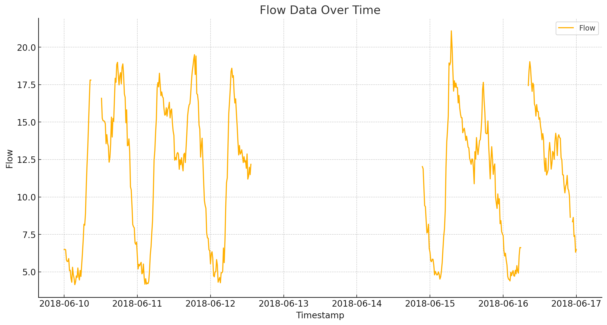
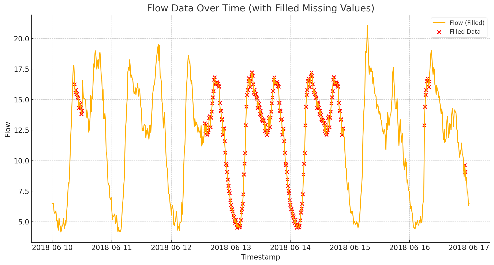

# WaterGPT
examples for AI use in water operations.
> [!NOTE]
> The responses and not deterministic and you might need to adjust your prompts. 

Example 1 - Missing data imputation
-----------

Upload the [flow excel file](data)

> **User:** *plot the attached data*.

> **ChatGPT:** *Here is the plot of the flow data over time based on the provided dataset.*

> 

> **User:** fill in the missing flow data based on the daily pattern, plot again, and indicate the filled in data using red color

> **ChatGPT:** *Here is the updated plot showing the flow data over time, with missing values filled based on the daily pattern.* 

> 

Example 2 - Importing, processing, and visualizing asset data
-----------

Upload the [pipes and junctions files](data)

> **User:** *open the zip files and examine the files*.

> **ChatGPT:** *the contents of the zip files are as follows: ...These files are components of shapefiles typically used in geographic information systems (GIS) for mapping and spatial analysis. Would you like to explore the data within these files further? ​.*

> **User:** *...*.

> **ChatGPT:** *...*

> 

<!-- 

Upload the [flow excel file](data)

> **User:** *plot the attached data*.

> **ChatGPT:** *Here is the plot of the flow data over time based on the provided dataset.*

> 

> **User:** fill in the missing flow data based on the daily pattern, plot again, and indicate the filled in data using red color

> 

-->

<!-- 
> [!NOTE]
> Useful information that users should know, even when skimming content.

> [!TIP]
> Helpful advice for doing things better or more easily.

> [!IMPORTANT]
> Key information users need to know to achieve their goal.

.. _`MAGNets: Model Reduction and Aggregation of Water Networks`: https://ascelibrary.org/doi/full/10.1061/JWRMD5.WRENG-5486

> fasdf `#RRGGBB`
-->
