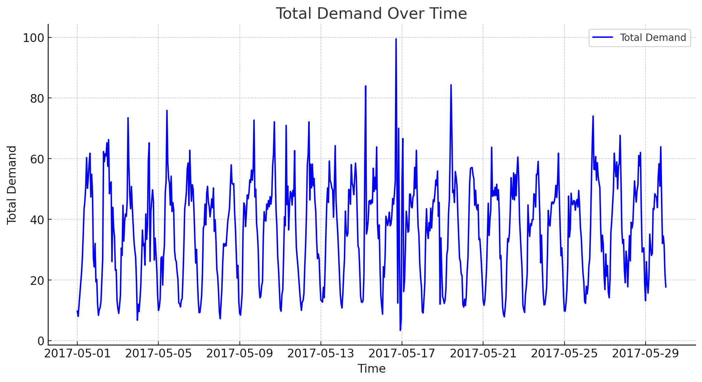
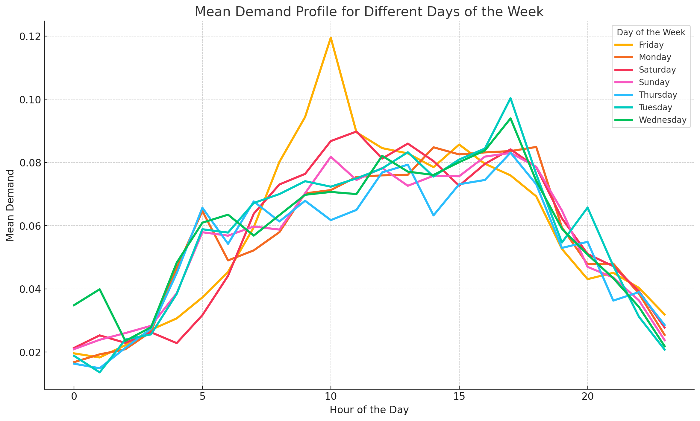
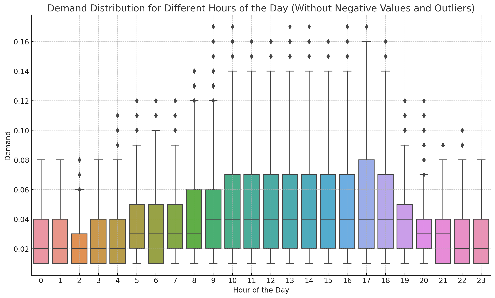
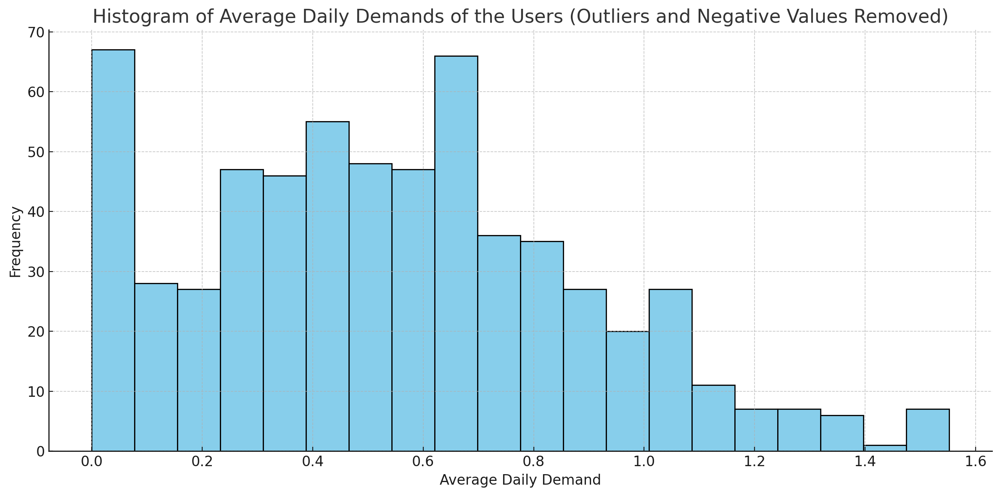
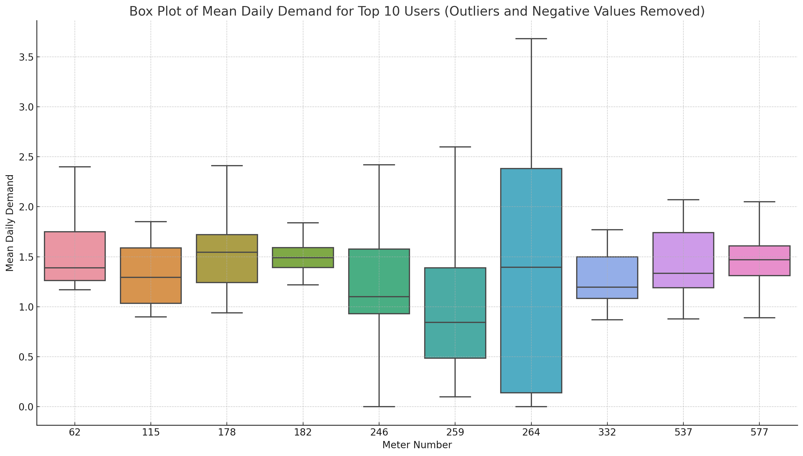
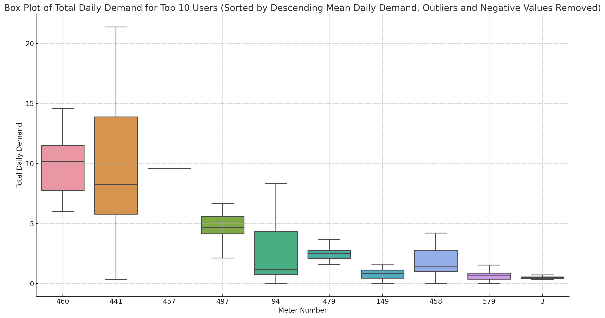

# WaterGPT
Examples of AI use in water operations.
> [!NOTE]
> The responses are not deterministic; you might need to adjust your prompts. 

Example 1 - Missing data imputation
-----------

Upload the [flow excel file](data/flow_missing_data.xlsx)

> **User:** *plot the attached data*.

> **ChatGPT:** *Here is the plot of the flow data over time based on the provided dataset.*

> 

> **User:** fill in the missing flow data based on the daily pattern, plot again, and indicate the filled in data using red color

> **ChatGPT:** *Here is the updated plot showing the flow data over time, with missing values filled based on the daily pattern.* 

> 

Example 2 - Importing, processing, and visualizing asset data
-----------

Upload the [pipes and junctions files](data)

> **User:** *Open the zip files and examine the files*.

> **ChatGPT:** *the contents of the zip files are as follows: ...These files are components of shapefiles typically used in geographic information systems (GIS) for mapping and spatial analysis. Would you like to explore the data within these files further? ​.*

> **User:** *Plot the water pipes and junctions*.

> **ChatGPT:** *Here is the plot showing the water pipes and junctions. The blue lines represent the pipes, and the red dots represent the junctions*.

> 

Upload the [meters file](data)

> **User:** *This is a water meters layer. Load the file and add the meters to the plot*.

> **ChatGPT:** *Here is the updated plot, now including the water meters. The green "x" markers represent the meters, alongside the blue pipes and red junctions*.

> 

> **User:** *I want to associate each meter with the closest junction. Plot a gray line connecting the meters with their associated junction*.

> **ChatGPT:** *The plot now includes gray lines connecting each water meter to its closest junction*.

> 

> **User:** *I want to associate each meter with its closest pipe. Add a line perpendicular to the pipe*.

> **ChatGPT:** *The plot now includes gray lines connecting each water meter to its closest pipe with a perpendicular connection*.

> 

> **User:** *Save a file with the closest junction and pipe for each meter*.

> **ChatGPT:** *The associations between meters, closest junctions, and closest pipes have been saved to a CSV file. You can download it using the link below:*

[meter_associations.csv](data/meter_associations.csv)

Example 3 - Analyzing AMI data
-----------
Upload the [consumers data](data)

> **User:** *Load and describe the data*.

> **ChatGPT:** *The data from the sheet "Demand May" consists of the following columns: ..​.*

> **User:** *Sum over different meter numbers and plot the total demand over time*.

> **ChatGPT:** *The plot above shows the total demand over time, summing the demand values across different meter numbers...*.

> 

> **User:** *Show the mean demand profile for 24 hours for different days of the week*.

> **ChatGPT:** *The plot illustrates the mean demand profile for 24 hours across different days of the week. Each line represents a day of the week, showing the average demand at each hour. ...*.

> 

> **User:** *This data is from Ein Mahil is an Arab local council in Israel, it has a population of 13,931, the majority of which are Muslims. Can you explain the early peak on Friday?*.

> **ChatGPT:** *The early peak in demand on Friday can be attributed to the cultural and religious practices of the Muslim community in Ein Mahil. For Muslims, Friday is considered a holy day, known as Jumu'ah. It involves special congregational prayers (Jumu'ah prayers) that take place around midday.  ...*.

> **User:** *Make boxplot for different hours of the day, remove outlier*.

> **ChatGPT:** *The box plot above shows the demand distribution for each hour of the day, with outliers removed.  ...*.

> 

> **User:** *Repeat and remove negative values*.

> **ChatGPT:** *The box plot now shows the demand distribution for each hour of the day, with outliers and negative values removed ...*.

> 

> **User:** *Make histogram of average daily demands of the users, remove outliers and negative values*.

> **ChatGPT:** *The histogram now shows the distribution of average daily demands for users, with both outliers and negative values removed ...*.

> 

> **User:** *Make boxplot of mean daily demand for top 10 users, remove negative values and outliers*.

> **ChatGPT:** *The box plot displays the mean daily demand for the top 10 users, with outliers and negative values removed ...*.

> 

> **User:** *Make boxplot of total daily demand for top 10 users, remove negative values and outliers*.

> **ChatGPT:** *The box plot displays the total daily demand for the top 10 users, with outliers and negative values removed ...*.

> 

<!-- 

Upload the [flow excel file](data)

> **User:** *plot the attached data*.

> **ChatGPT:** *Here is the plot of the flow data over time based on the provided dataset.*

> 

> **User:** fill in the missing flow data based on the daily pattern, plot again, and indicate the filled in data using red color

> 

-->

<!-- 
> [!NOTE]
> Useful information that users should know, even when skimming content.

> [!TIP]
> Helpful advice for doing things better or more easily.

> [!IMPORTANT]
> Key information users need to know to achieve their goal.

.. _`MAGNets: Model Reduction and Aggregation of Water Networks`: https://ascelibrary.org/doi/full/10.1061/JWRMD5.WRENG-5486

> fasdf `#RRGGBB`
-->
